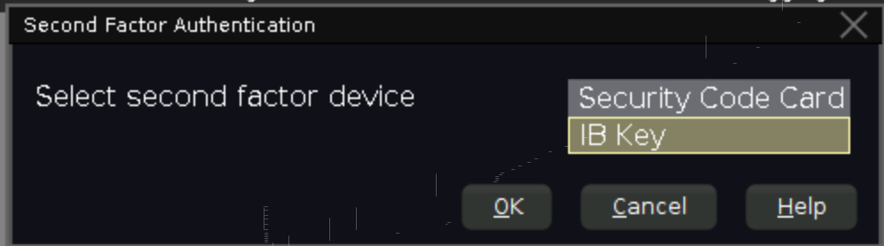

# docker-interactivebroker-gateway #

## Dockerized InteractiveBroker Gateway ##

### A word of caution first

It is **no longer possible** to let the Gateway run 24/7 with occasional automated restarts. This is due to an increased
level of security required by Interactive Broker.

The image below is therefore intended for manual starts. Some automation still takes place: the user and password are
filled in automatically at start time, so that no VNC connection is required **EXCEPT** for the very first time in order
to retrieve the generated 2FA token stored in the container in the config file _/root/Jts/jts.ini_

### Prerequisites (initial, one-off procedure)

First of all you need to activate 2FA from the Interactive Broker account security admin page, if not already done.

At this point you will need to start the docker container, only to retrieve the 2FA token:
```
IB_TRADING_MODE=live docker-compose up
```

When started the container should be stuck at the login screen, waiting for someone to input username and password.

Connect using VNC  on `127.0.0.1:5901` and password _1234_ (by default). Make sure to select "IB Key" as a
second factor device.



**The result of all this is that the Gateway will have updated the _/root/Jts/jts.ini_ config file
with your 2FA token.** So one simple way to extract the token is by issuing the command under the same directory
in another shell:

> docker-compose exec tws grep ^2ndFactor= /root/Jts/jts.ini

You should see a line like:

>2ndFactor=_abcdefghijklmnopqrstuvwxyz_,5.2a;

You are interested in the _abcdefghijklmnopqrstuvwxyz_ part: this is the 2FA token, keep it for later. If the line you
get looks like this:

>2ndFactor=,5.2a;

Something went wrong. Make sure to really select "IB Key" in the procedure above and click "OK".

Now you can shutdown the container:
```
docker-compose down
```

It is eventually time to create 3 secrets for IB authentication:

> echo _your_username_ > ib_username.secret
> 
> echo _your password_ > ib_password.secret
> 
> echo _your_2FA_token_ > ib_token_2fa.secret

| File                | Description                                           |
|---------------------|-------------------------------------------------------|
| ib_username.secret  | Username for your InteractiveBroker account           |
| ib_password.secret  | Password for your InteractiveBroker account           |
| ib_token_2fa.secret | This is the identifier used by IB for sending the 2FA |

From the 3 parameters above, only the 2FA requires some initial effort, as described above.

### Normal operation

Starting InteractiveBroker Gateway as a container (defaults to PAPER mode):
```
docker-compose up
```

You will see the following exception in the logs, this is fine:
```
tws_1  | java.lang.InterruptedException
tws_1  |        at java.util.concurrent.locks.AbstractQueuedSynchronizer.doAcquireSharedInterruptibly(AbstractQueuedSynchronizer.java:998)
tws_1  |        at java.util.concurrent.locks.AbstractQueuedSynchronizer.acquireSharedInterruptibly(AbstractQueuedSynchronizer.java:1304)
tws_1  |        at java.util.concurrent.CountDownLatch.await(CountDownLatch.java:231)
tws_1  |        at com.sun.javafx.application.PlatformImpl.waitForStart(PlatformImpl.java:256)
tws_1  |        at com.sun.javafx.application.PlatformImpl.runLater(PlatformImpl.java:277)
tws_1  |        at com.sun.javafx.application.PlatformImpl.runLater(PlatformImpl.java:268)
tws_1  |        at com.sun.javafx.application.PlatformImpl.checkIdle(PlatformImpl.java:392)
tws_1  |        at com.sun.javafx.application.PlatformImpl.setImplicitExit(PlatformImpl.java:346)
tws_1  |        at javafx.application.Platform.setImplicitExit(Platform.java:138)
tws_1  |        at twslaunch.gstat.j.a(j.java:88)
tws_1  |        at twslaunch.gstat.a.d(a.java:215)
tws_1  |        at twslaunch.gstat.a.g(a.java:117)
tws_1  |        at java.util.concurrent.Executors$RunnableAdapter.call(Executors.java:511)
tws_1  |        at java.util.concurrent.FutureTask.runAndReset(FutureTask.java:308)
tws_1  |        at java.util.concurrent.ScheduledThreadPoolExecutor$ScheduledFutureTask.access$301(ScheduledThreadPoolExecutor.java:180)
tws_1  |        at java.util.concurrent.ScheduledThreadPoolExecutor$ScheduledFutureTask.run(ScheduledThreadPoolExecutor.java:294)
tws_1  |        at java.util.concurrent.ThreadPoolExecutor.runWorker(ThreadPoolExecutor.java:1149)
tws_1  |        at java.util.concurrent.ThreadPoolExecutor$Worker.run(ThreadPoolExecutor.java:624)
tws_1  |        at java.lang.Thread.run(Thread.java:748)
```

If you would like to start in LIVE mode you need to set the relevant environment variable:
```
IB_TRADING_MODE=live docker-compose up
```

The container completes the startup process by displaying following line (assuming default ports are used):

```
tws_1  | Forking :::4001 onto 0.0.0.0:4003
```

**You should get a notification on your mobile phone from the IBKey app, which you need to acknowledge.**

You can inspect the running Gateway at any time using VNC on `127.0.0.1:5901` (assuming default port is used).
 Default VNC password is `1234` ... `¯\_(ツ)_/¯` 

Shutting down the InteractiveBroker Gateway container:
```
docker-compose down
```
